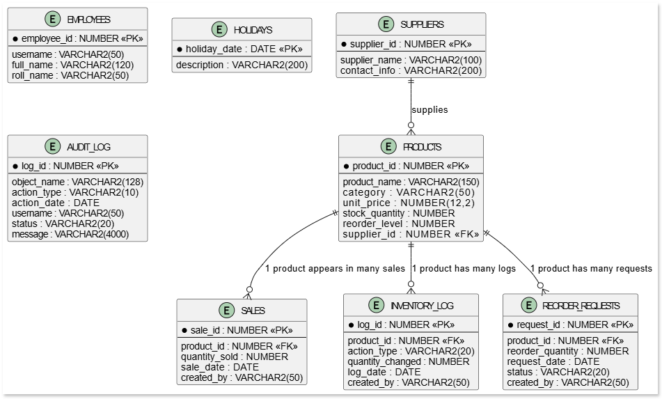
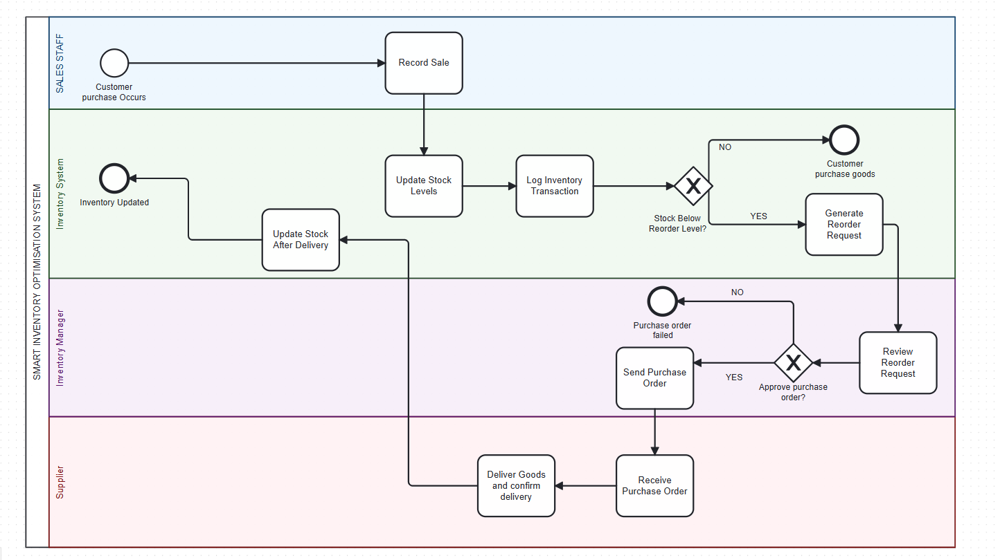
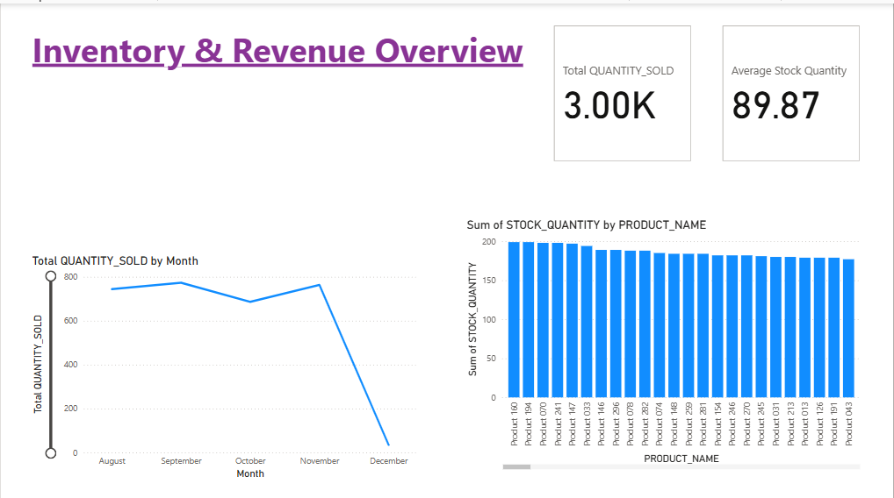
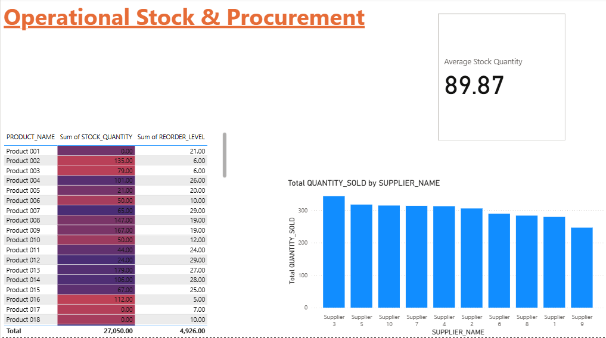

  # 🛒 Smart Inventory Optimization System

## PL/SQL FINAL EXAM – AUCA
**Student:** RUREBWAYIRE AMPOZE Ariella
**ID:** [27640]

---

## 💡 Project Overview
A **PL/SQL–driven inventory management system** that automates stock updates, predicts reorder needs, enforces business rules, and maintains an audit trail. The system reduces stockouts, prevents overstocking, and improves decision-making using analytics.

## ⚠️ Problem Statement
Many businesses struggle with **inaccurate stock records**, **delayed restocking**, and **manual errors**. This results in stockouts, financial loss, and inefficiency. The project solves this through **automated stock tracking**, **optimized reorder decisions**, and **auditing**.

## 🎯 Key Objectives
* Maintain **accurate real-time stock levels**
* Auto-generate **optimized reorder requests**
* Enforce business rules (**weekday/holiday restrictions**)
* Log all activities for **auditing**
* Support **analytics and BI reporting**

---

## 📁 Repository Structure
* **/docs/** 
* **/sql/** 
* **/screenshots/** 
* **/presentation/**

## 🚀 Quick Start Instructions (Execution Order)
1.  Connect as **INV\_ADMIN** in SQL Developer
2.  Run scripts in this order:
    * **Tables & Sequences:**[Creating Tables and Sequences](sql/01_create_tables_and_sequences.sql)
    * **Sample Data:** [Inserting Sample Data](sql/02_insert_sample_data.sql)
    * **Package Specification:** [Package Inventory Specification](sql/10_pkg_inventory_spec.sql)
    * **Package Body:** [Package Body](sql/11_pkg_inventory_body.sql)
    * **Audit/Rules:** [Restrictions and Audit](sql/20_restriction_and_audit.sql)
3.  Test using the verification scripts below.

---

## 🧪 Testing and Verification
The system's core functionality and business rules are verified using the following test cases:

* **Core Logic Test Cases:** [Verification Queries](sql/03_test_queries.sql) - Run to test procedures/functions, basic stock updates, and primary business logic.
* **Constraint/Rule Enforcement:** [Audit and Restriction Script](sql/20_restriction_and_audit.sql) - **Critical Test** to verify that weekday/holiday restrictions are enforced and audit logs are correctly generated.
* **Analytics Validation:** [Analytics Examples](sql/12_analytics_examples.sql) - Run to confirm data aggregation and BI readiness for calculating KPIs.

---

## 📝 Documentation Included
* **ERD:**
* **BPMN:** 
* **PHASE II:**[PhaseII](docs/PhaseII.pdf)
* **PHASE III:**[PhaseIII](docs/PhaseIII.md)
* **Data dictionary:** [Data Dictionary](docs/data_dictionary.md) 

| Table | Column | Type | Constraints | Purpose |
| :--- | :--- | :--- | :--- | :--- |
| **SUPPLIERS** | `supplier_id` | `NUMBER` | **PK** | Supplier identifier |
| | `supplier_name` | `VARCHAR2(100)` | NOT NULL | Supplier name |
| | `contact_info` | `VARCHAR2(200)` | | Email/phone/address |
| **EMPLOYEES** | `employee_id` | `NUMBER` | **PK** | Employee id |
| | `username` | `VARCHAR2(50)` | NOT NULL, **UNIQUE** | Login or id string |
| | `full_name` | `VARCHAR2(120)` | | Employee's full name |
| | `roll_name` | `VARCHAR2(50)` | | Employee's role name |
| **PRODUCTS** | `product_id` | `NUMBER` | **PK** | Product id |
| | `product_name` | `VARCHAR2(150)` | NOT NULL | Human-readable name |
| | `category` | `VARCHAR2(50)` | | Product category |
| | `unit_price` | `NUMBER(12,2)` | | Price per unit |
| | `stock_quantity` | `NUMBER` | NOT NULL, DEFAULT 0 | Current on-hand quantity |
| | `reorder_level` | `NUMBER` | NOT NULL, DEFAULT 0 | Reorder threshold |
| | `supplier_id` | `NUMBER` | **FK** $\to$ `suppliers(supplier_id)` | Preferred supplier |
| **SALES** | `sale_id` | `NUMBER` | **PK** | Sales transaction id |
| | `product_id` | `NUMBER` | **FK** $\to$ `products(product_id)` | Sold product |
| | `quantity_sold` | `NUMBER` | NOT NULL | Quantity sold |
| | `sale_date` | `DATE` | NOT NULL, DEFAULT SYSDATE | When sale occurred |
| | `created_by` | `VARCHAR2(50)` | | username/employee who recorded |
| **INVENTORY\_LOG** | `log_id` | `NUMBER` | **PK** | Inventory change id |
| | `product_id` | `NUMBER` | **FK** $\to$ `products(product_id)`, NOT NULL | Referring to the sold product |
| | `action_type` | `VARCHAR2(20)` | NOT NULL | SALE/RESTOCK/ADJUST |
| | `quantity_changed` | `NUMBER` | NOT NULL | Positive for inbound, negative for outbound |
| | `log_date` | `DATE` | NOT NULL, DEFAULT SYSDATE | When sale/restock/adjust occurred |
| | `created_by` | `VARCHAR2(50)` | | username/employee who recorded |
| **REORDER\_REQUESTS** | `request_id` | `NUMBER` | **PK** | Reorder request id |
| | `product_id` | `NUMBER` | **FK** $\to$ `products(product_id)`, NOT NULL | Referring to the product |
| | `reorder_quantity` | `NUMBER` | NOT NULL | Suggested quantity to order |
| | `request_date` | `DATE` | NOT NULL, DEFAULT SYSDATE | When reorder request occurred |
| | `status` | `VARCHAR2(20)` | DEFAULT 'PENDING' | PENDING/APPROVED/REJECTED |
| | `created_by` | `VARCHAR2(50)` | | username/employee who recorded |
| **HOLIDAYS** | `holiday_date` | `DATE` | **PK** | Holiday used by business rule |
| | `description` | `VARCHAR2(200)` | | Description of holidays observed |
| **AUDIT\_LOG** | `log_id` | `NUMBER` | **PK** | Audit record id |
| | `object_name` | `VARCHAR2(128)` | | Table/object touched |
| | `action_type` | `VARCHAR2(10)` | | INSERT/UPDATE/DELETE |
| | `action_date` | `DATE` | NOT NULL, DEFAULT SYSDATE | When insert/update/delete occurred |
| | `username` | `VARCHAR2(50)` | | Who performed action |
| | `status` | `VARCHAR2(20)` | | ALLOWED/DENIED |
| | `message` | `VARCHAR2(4000)` | | Any comments that might be added |

---

## 📈 Business Intelligence
**KPIs supported:**
* Stockout rate
* Supplier performance
* Sales trends
* Audit violations

**Dashboards :**
* **Executive Summary:**
* **Audit Monitoring:**
* **Inventory Performance:**

---

## ✅ Conclusion
This system improves **stock accuracy**, automates key operations, strengthens security through **auditing**, and provides **BI insights** for better decisions.
